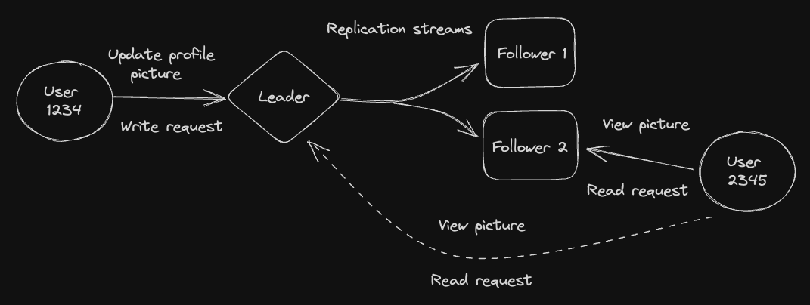

# System Design Resources
Mostly key concepts taken from Design Data Intensive Application book for now.

Index
--------

[Part I. Foundations of Data Systems](#part-1)
* [Reliable, Scalable, and Maintainable Applications](#part-1.1)
* [Data Models and Query Languages](#part-1.2)

### Part I. Foundations of Data Systems 
#### Chapter 1. Reliable, Scalable, and Maintainable Applications 
* Reliability means making systems work correctly, even when faults occur aka *fault-tolerant*.
* Scalability means having strategies for keeping performance good, even when load increases.
  * Percentiles are used to describe performance, usually abbreviated as p95, p99, p999, etc.
    * pN: response time threshold where N% of requests were faster, and (100-N)% were slower.
  * Approaches for coping with load
    * *Vertical scaling*: switching to a more powerful machine.
    * *Horizontal scaling*: distributing load across smaller machines.
    * *Elastic* system can automatically add computing resources when there is a load increase.
* Maintainability means making life better for eng and ops folks to work on the system.
  * Operability: Easy for ops to keep the system running smoothly.
  * Simplicity: Easy for new eng to understand the system.
  * Evolvability: Easy for eng to make changes to the system in the future.
 
#### Chapter 2. Data Models and Query Languages 

| Database   | Pros                                                                                             | Cons                                    |
|:-----------|:---------------------------------------------------------------------------------------------------------------|:----------------------------------------------------------|
| Relational | Joins support for many-to-one / many-to-many relationships.  Enforcement of records with same structure.   | Heterogenous structure.                                   |
| Document   | Tree-like structure (1-to-many relationships).  Schema flexibility and better performance due to locality. | Deeply nested structure.  Many-to-many relationships. |
| Graph      | Interconnected data with many-to-many relationships.  Homogeneous data.                                    | N/A                                                       |

### Part II. Distributed Data 
* Motivation for distributing database across machines
  * Scalability: handle increasing load by spreading it across machines.
  * High availability: if one machine goes down, the other can take over.
  * Latency: data center are placed geographically closer to users.
* There are 2 ways to distribute a database
  * **Replication**: keeping a copy of the same data on several different machines.
  * **Partitioning** aka sharding: splitting a big database into smaller subsets called *partitions*.

#### Chapter 5. Replication 

* Algorithms for maintaining replicas
  * **Single-leader replication**: one node is the leader, all writes go to the leader, and the leader sends data to all the followers.
  
   *Note: Client can read from leader / followers.*
  * **Multi-leader replication**: To be added.
  * **Leaderless replication**: To be added.
* Replication lag
